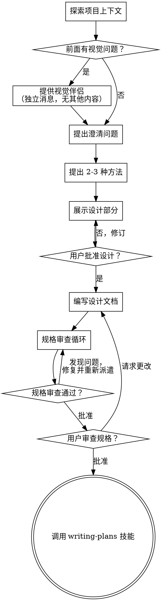

# 将想法头脑风暴成设计

通过自然的协作对话帮助将想法转化为完整的设计和规格文档。

首先了解当前项目上下文，然后逐一提问来细化想法。一旦你理解了要构建什么，展示设计并获得用户批准。

<HARD-GATE>
在展示设计并获得用户批准之前，不要调用任何实现技能、编写任何代码、搭建任何项目或采取任何实现行动。这适用于每个项目，无论看起来多么简单。
</HARD-GATE>

## 反模式："这太简单了不需要设计"

每个项目都要经历这个过程。一个待办列表、一个单函数工具、一个配置更改——所有这些都是。"简单"项目正是未经审查的假设导致最多浪费工作的地方。设计可以很短（对于真正简单的项目只需几句话），但你必须展示它并获得批准。

## 检查清单

你必须为以下每项创建任务并按顺序完成：

1. **探索项目上下文** — 检查文件、文档、最近提交
2. **提供视觉伴侣**（如果主题将涉及视觉问题）— 这是独立的消息，不与澄清问题结合。参见下面的视觉伴侣部分。
3. **提出澄清问题** — 一次一个，理解目的/约束/成功标准
4. **提出 2-3 种方法** — 带权衡和你的推荐
5. **展示设计** — 按复杂度分段展示，每段后获得用户批准
6. **编写设计文档** — 保存到 `docs/superpowers/specs/YYYY-MM-DD-<topic>-design.md` 并提交
7. **规格审查循环** — 派遣规格文档审查子代理，提供精确编写的审查上下文（不是你的会话历史）；修复问题并重新派遣直到批准（最多 5 次迭代，然后提交给人工）
8. **用户审查书面规格** — 请求用户在继续之前审查规格文件
9. **过渡到实现** — 调用 writing-plans 技能创建实现计划

## 流程图

**终端状态是调用 writing-plans。** 不要调用 frontend-design、mcp-builder 或任何其他实现技能。头脑风暴后你调用的唯一技能是 writing-plans。

## 流程

**理解想法：**

- 首先检查当前项目状态（文件、文档、最近提交）
- 在提出详细问题之前，评估范围：如果请求描述了多个独立子系统（例如"构建一个包含聊天、文件存储、计费和分析的平台"），立即标记。不要花时间细化一个需要先分解的项目的细节。
- 如果项目对于单个规格太大，帮助用户分解为子项目：独立的部分是什么、它们如何关联、应该按什么顺序构建？然后通过正常设计流程头脑风暴第一个子项目。每个子项目有自己的规格 → 计划 → 实现循环。
- 对于范围适当的项目，一次问一个问题来细化想法
- 尽可能使用选择题，但开放式也可以
- 每条消息只问一个问题 - 如果某个话题需要更多探索，拆分成多个问题
- 聚焦于理解：目的、约束、成功标准

**探索方法：**

- 提出 2-3 种不同方法及其权衡
- 以对话方式展示选项，给出你的推荐和理由
- 以你推荐的选项开头并解释为什么

**展示设计：**

- 一旦你相信你理解了要构建什么，展示设计
- 每个部分的复杂度要适当：如果直截了当只需几句话，如果微妙则需要 200-300 字
- 每个部分后询问目前看起来是否正确
- 覆盖：架构、组件、数据流、错误处理、测试
- 准备好返回去澄清如果有不合理的地方

**为隔离和清晰而设计：**

- 将系统分解为更小的单元，每个单元有单一明确的目的，通过定义良好的接口通信，可以独立理解和测试
- 对于每个单元，你应该能回答：它做什么、你如何使用它、它依赖什么？
- 某人能否在不阅读其内部的情况下理解一个单元做什么？你能否在不破坏消费者的情况下更改内部？如果不能，边界需要改进。
- 更小、边界清晰的单元也更容易让你处理 - 你对能同时保持在上下文中的代码推理更好，当文件聚焦时你的编辑更可靠。当一个文件变大时，这通常是一个信号，表明它做的事情太多了。

**在现有代码库中工作：**

- 在提出更改之前探索当前结构。遵循现有模式。
- 当现有代码存在影响工作的问题（例如，文件变得太大、边界不清晰、责任纠缠）时，将针对性的改进作为设计的一部分 - 就像一个好的开发者改进他们正在工作的代码一样。
- 不要提出无关的重构。专注于服务于当前目标的事情。

## 设计之后

**文档：**

- 将验证过的设计（规格）写入 `docs/superpowers/specs/YYYY-MM-DD-<topic>-design.md`
  - （用户对规格位置的偏好覆盖此默认值）
- 如果可用，使用 elements-of-style:writing-clearly-and-concisely 技能
- 将设计文档提交到 git

**规格审查循环：**
编写规格文档后：

1. 派遣规格文档审查子代理（参见 spec-document-reviewer-prompt.md）
2. 如果发现问题：修复、重新派遣、重复直到批准
3. 如果循环超过 5 次，提交给人工寻求指导

**用户审查关卡：**
规格审查循环通过后，请求用户在继续之前审查书面规格：

> "规格已写入并提交到 `<path>`。请审查它，让我们开始编写实现计划之前，告诉我你是否想做任何更改。"

等待用户响应。如果他们请求更改，进行更改并重新运行规格审查循环。只有在用户批准后才继续。

**实现：**

- 调用 writing-plans 技能创建详细的实现计划
- 不要调用任何其他技能。writing-plans 是下一步。

## 关键原则

- **一次一个问题** - 不要用多个问题压倒用户
- **优先使用选择题** - 比开放式更容易回答
- **严格执行 YAGNI** - 从所有设计中删除不必要的功能
- **探索替代方案** - 在确定之前总是提出 2-3 种方法
- **增量验证** - 展示设计，在继续之前获得批准
- **保持灵活** - 当某些东西不合理时返回去澄清

## 视觉伴侣

用于在头脑风暴期间展示模型、图表和视觉选项的基于浏览器的伴侣。作为工具可用 — 不是模式。接受伴侣意味着它可用于受益于视觉处理的问题；这并不意味着每个问题都通过浏览器处理。

**提供伴侣：** 当你预期即将到来的问题将涉及视觉内容（模型、布局、图表）时，一次性提供征求同意：
> "我们正在处理的一些内容如果能在网页浏览器中展示给你可能会更容易解释。我可以随时组合模型、图表、比较和其他视觉效果。这个功能还比较新，可能会消耗较多 token。想试试吗？（需要打开一个本地 URL）"

**这个提议必须是独立的消息。** 不要将它与澄清问题、上下文摘要或任何其他内容结合。消息应该只包含上面的提议，没有其他内容。在继续之前等待用户响应。如果他们拒绝，继续纯文本头脑风暴。

**每个问题的决策：** 即使在用户接受后，也要为每个问题决定是使用浏览器还是终端。测试标准是：**用户通过看到比通过阅读能更好地理解这个吗？**

- **使用浏览器** 处理本身就是视觉的内容 — 模型、线框图、布局比较、架构图、并排视觉设计
- **使用终端** 处理文本内容 — 需求问题、概念选择、权衡列表、A/B/C/D 文本选项、范围决策

关于 UI 话题的问题不自动是视觉问题。"在这个上下文中个性意味着什么？"是概念问题 — 使用终端。"哪种向导布局更好？"是视觉问题 — 使用浏览器。

如果他们同意使用伴侣，在继续之前阅读详细指南：
`skills/brainstorming/visual-companion.md`
