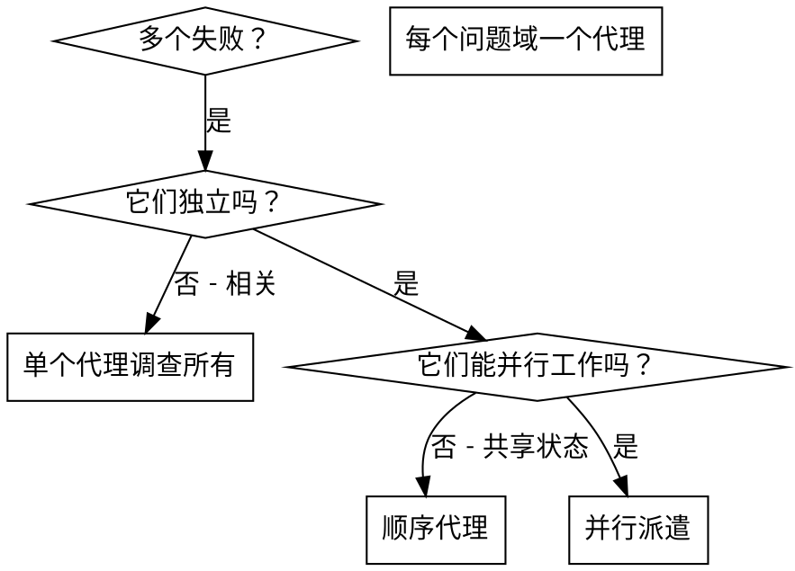

# 派遣并行代理

## 概述

你将任务委托给具有隔离上下文的专门代理。通过精确编写他们的指令和上下文，你确保他们保持专注并成功完成任务。他们永远不应该继承你会话的上下文或历史 — 你构建他们需要的确切内容。这也保留了你自己的上下文用于协调工作。

当你有多个不相关的失败（不同的测试文件、不同的子系统、不同的 bug）时，按顺序调查浪费时间。每次调查都是独立的，可以并行发生。

**核心原则：** 每个独立问题域派遣一个代理。让他们并发工作。

## 何时使用



**使用时机：**
- 3+ 个测试文件失败，原因不同
- 多个子系统独立损坏
- 每个问题可以在没有其他上下文的情况下理解
- 调查之间没有共享状态

**不要使用当：**
- 失败是相关的（修复一个可能修复其他）
- 需要理解完整系统状态
- 代理会互相干扰

## 模式

### 1. 识别独立域

按损坏内容分组失败：
- 文件 A 测试：工具审批流程
- 文件 B 测试：批次完成行为
- 文件 C 测试：中止功能

每个域是独立的 — 修复工具审批不影响中止测试。

### 2. 创建聚焦的代理任务

每个代理获得：
- **特定范围：** 一个测试文件或子系统
- **清晰目标：** 让这些测试通过
- **约束：** 不要更改其他代码
- **期望输出：** 发现和修复的摘要

### 3. 并行派遣

```typescript
// 在 Claude Code / AI 环境中
Task("修复 agent-tool-abort.test.ts 失败")
Task("修复 batch-completion-behavior.test.ts 失败")
Task("修复 tool-approval-race-conditions.test.ts 失败")
// 三个同时运行
```

### 4. 审查和集成

当代理返回时：
- 阅读每个摘要
- 验证修复不冲突
- 运行完整测试套件
- 集成所有更改

## 代理提示结构

好的代理提示是：
1. **聚焦** - 一个清晰的问题域
2. **自包含** - 理解问题所需的所有上下文
3. **具体说明输出** - 代理应该返回什么？

```markdown
修复 src/agents/agent-tool-abort.test.ts 中的 3 个失败测试：

1. "should abort tool with partial output capture" - 期望消息中有 'interrupted at'
2. "should handle mixed completed and aborted tools" - 快速工具中止而不是完成
3. "should properly track pendingToolCount" - 期望 3 个结果但得到 0

这些是时序/竞态条件问题。你的任务：

1. 阅读测试文件，理解每个测试验证什么
2. 识别根本原因 - 时序问题还是实际 bug？
3. 通过以下方式修复：
   - 用基于事件的等待替换任意超时
   - 如果发现，修复中止实现中的 bug
   - 如果测试改变了行为，调整测试期望

不要只是增加超时 - 找到真正的问题。

返回：发现什么和修复什么的摘要。
```

## 常见错误

**❌ 太宽泛：** "修复所有测试" - 代理迷失
**✅ 具体：** "修复 agent-tool-abort.test.ts" - 聚焦范围

**❌ 没上下文：** "修复竞态条件" - 代理不知道在哪
**✅ 有上下文：** 粘贴错误消息和测试名称

**❌ 没约束：** 代理可能重构一切
**✅ 有约束：** "不要更改生产代码"或"只修复测试"

**❌ 模糊输出：** "修复它" - 你不知道改了什么
**✅ 具体：** "返回根本原因和更改的摘要"

## 何时不使用

**相关失败：** 修复一个可能修复其他 - 先一起调查
**需要完整上下文：** 理解需要看整个系统
**探索性调试：** 你还不知道什么坏了
**共享状态：** 代理会干扰（编辑相同文件、使用相同资源）

## 会话中的真实示例

**场景：** 大重构后 3 个文件中 6 个测试失败

**失败：**
- agent-tool-abort.test.ts: 3 个失败（时序问题）
- batch-completion-behavior.test.ts: 2 个失败（工具未执行）
- tool-approval-race-conditions.test.ts: 1 个失败（执行计数 = 0）

**决策：** 独立域 - 中止逻辑与批次完成与竞态条件分开

**派遣：**
```
代理 1 → 修复 agent-tool-abort.test.ts
代理 2 → 修复 batch-completion-behavior.test.ts
代理 3 → 修复 tool-approval-race-conditions.test.ts
```

**结果：**
- 代理 1：用基于事件的等待替换超时
- 代理 2：修复事件结构 bug（threadId 在错误位置）
- 代理 3：添加等待异步工具执行完成

**集成：** 所有修复独立，无冲突，完整套件绿色

**节省时间：** 3 个问题并行解决 vs 顺序

## 关键好处

1. **并行化** - 多个调查同时发生
2. **聚焦** - 每个代理有窄范围，更少上下文跟踪
3. **独立性** - 代理不互相干扰
4. **速度** - 3 个问题在 1 个时间内解决

## 验证

代理返回后：
1. **审查每个摘要** - 理解改了什么
2. **检查冲突** - 代理编辑了相同代码吗？
3. **运行完整套件** - 验证所有修复一起工作
4. **抽查** - 代理可能犯系统性错误

## 实际影响

从调试会话（2025-10-03）：
- 3 个文件中 6 个失败
- 并行派遣 3 个代理
- 所有调查同时完成
- 所有修复成功集成
- 代理更改之间零冲突
