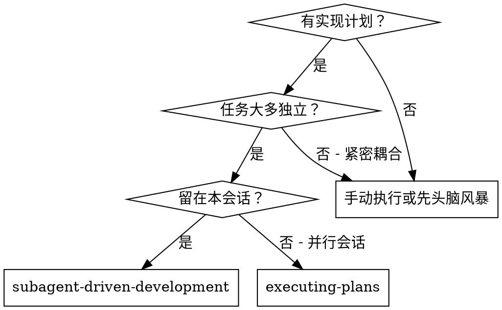
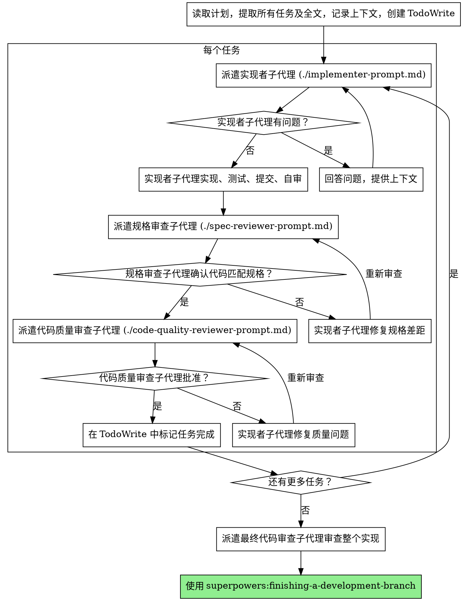

# 子代理驱动开发

通过为每个任务派遣新鲜子代理来执行计划，每个任务后有两阶段审查：先规格合规审查，再代码质量审查。

**为什么用子代理：** 你将任务委托给具有隔离上下文的专门代理。通过精确编写他们的指令和上下文，你确保他们保持专注并成功完成任务。他们永远不应该继承你会话的上下文或历史 — 你构建他们需要的确切内容。这也保留了你自己的上下文用于协调工作。

**核心原则：** 每个任务新鲜子代理 + 两阶段审查（先规格后质量）= 高质量、快速迭代

## 何时使用



**vs. Executing Plans（并行会话）：**
- 同一会话（无上下文切换）
- 每个任务新鲜子代理（无上下文污染）
- 每个任务后两阶段审查：先规格合规，再代码质量
- 更快迭代（任务间无需人工介入）

## 流程



## 模型选择

使用能处理每个角色的最低能力模型来节省成本并提高速度。

**机械实现任务**（隔离函数、清晰规格、1-2 个文件）：使用快速、便宜的模型。当计划详细明确时，大多数实现任务是机械的。

**集成和判断任务**（多文件协调、模式匹配、调试）：使用标准模型。

**架构、设计和审查任务**：使用最强大的可用模型。

**任务复杂度信号：**
- 触及 1-2 个文件且有完整规格 → 便宜模型
- 触及多个文件且有集成关注 → 标准模型
- 需要设计判断或广泛代码库理解 → 最强大模型

## 处理实现者状态

实现者子代理报告四种状态之一。适当处理每种：

**DONE：** 继续规格合规审查。

**DONE_WITH_CONCERNS：** 实现者完成了工作但标记了疑虑。在继续之前阅读关切。如果关切是关于正确性或范围，在审查前解决。如果是观察（例如"这个文件变大了"），记录并继续审查。

**NEEDS_CONTEXT：** 实现者需要未提供的信息。提供缺失上下文并重新派遣。

**BLOCKED：** 实现者无法完成任务。评估阻碍：
1. 如果是上下文问题，提供更多上下文并用相同模型重新派遣
2. 如果任务需要更多推理，用更强大的模型重新派遣
3. 如果任务太大，拆分成更小的部分
4. 如果计划本身有问题，升级给人工

**永远不要**忽略升级或强制相同模型在没有变化的情况下重试。如果实现者说卡住了，就需要改变什么。

## 提示模板

- `./implementer-prompt.md` - 派遣实现者子代理
- `./spec-reviewer-prompt.md` - 派遣规格合规审查子代理
- `./code-quality-reviewer-prompt.md` - 派遣代码质量审查子代理

## 示例工作流

```
你：我正在使用子代理驱动开发来执行此计划。

[一次读取计划文件：docs/superpowers/plans/feature-plan.md]
[提取所有 5 个任务的全文和上下文]
[用所有任务创建 TodoWrite]

任务 1：Hook 安装脚本

[获取任务 1 文本和上下文（已提取）]
[用完整任务文本 + 上下文派遣实现子代理]

实现者："开始前 - hook 应该安装在用户级还是系统级？"

你："用户级（~/.config/superpowers/hooks/）"

实现者："明白了。正在实现..."
[稍后] 实现者：
  - 实现了 install-hook 命令
  - 添加了测试，5/5 通过
  - 自审：发现我漏了 --force 标志，添加了
  - 已提交

[派遣规格合规审查者]
规格审查者：✅ 规格合规 - 满足所有需求，没有额外内容

[获取 git SHA，派遣代码质量审查者]
代码审查者：优点：测试覆盖好，干净。问题：无。批准。

[标记任务 1 完成]

任务 2：恢复模式

[获取任务 2 文本和上下文（已提取）]
[用完整任务文本 + 上下文派遣实现子代理]

实现者：[没有问题，继续]
实现者：
  - 添加了 verify/repair 模式
  - 8/8 测试通过
  - 自审：都好
  - 已提交

[派遣规格合规审查者]
规格审查者：❌ 问题：
  - 缺失：进度报告（规格说"每 100 项报告"）
  - 额外：添加了 --json 标志（未请求）

[实现者修复问题]
实现者：移除了 --json 标志，添加了进度报告

[规格审查者再次审查]
规格审查者：✅ 现在规格合规

[派遣代码质量审查者]
代码审查者：优点：扎实。问题（重要）：魔法数字（100）

[实现者修复]
实现者：提取了 PROGRESS_INTERVAL 常量

[代码审查者再次审查]
代码审查者：✅ 批准

[标记任务 2 完成]

...

[所有任务后]
[派遣最终代码审查者]
最终审查者：满足所有需求，准备合并

完成！
```

## 优势

**vs. 手动执行：**
- 子代理自然遵循 TDD
- 每个任务新鲜上下文（无混淆）
- 并行安全（子代理不干扰）
- 子代理可以提问（工作前和工作中）

**vs. Executing Plans：**
- 同一会话（无移交）
- 持续进展（无需等待）
- 自动审查检查点

**效率提升：**
- 无文件读取开销（控制器提供全文）
- 控制器精确策划需要什么上下文
- 子代理预先获得完整信息
- 问题在工作开始前浮出水面（不是之后）

**质量关卡：**
- 自审在移交前捕获问题
- 两阶段审查：规格合规，然后代码质量
- 审查循环确保修复真正有效
- 规格合规防止过度/不足构建
- 代码质量确保实现构建良好

**成本：**
- 更多子代理调用（每个任务实现者 + 2 个审查者）
- 控制器做更多准备工作（预先提取所有任务）
- 审查循环增加迭代
- 但早期捕获问题（比以后调试便宜）

## 危险信号

**永远不要：**
- 没有明确用户同意就在 main/master 分支开始实现
- 跳过审查（规格合规或代码质量）
- 带着未修复问题继续
- 并行派遣多个实现子代理（冲突）
- 让子代理读取计划文件（改为提供全文）
- 跳过场景设置上下文（子代理需要理解任务在哪里适合）
- 忽略子代理问题（让他们继续前回答）
- 在规格合规上接受"差不多"（规格审查者发现问题 = 没完成）
- 跳过审查循环（审查者发现问题 = 实现者修复 = 再次审查）
- 让实现者自审替代实际审查（两者都需要）
- **在规格合规 ✅ 之前开始代码质量审查**（错误顺序）
- 在任一审查有未解决问题时移动到下一个任务

**如果子代理有问题：**
- 清晰完整地回答
- 如果需要提供额外上下文
- 不要催促他们进入实现

**如果审查者发现问题：**
- 实现者（同一子代理）修复它们
- 审查者再次审查
- 重复直到批准
- 不要跳过重新审查

**如果子代理失败任务：**
- 用具体指令派遣修复子代理
- 不要尝试手动修复（上下文污染）

## 集成

**必需工作流技能：**
- **superpowers:using-git-worktrees** - 必需：在开始前设置隔离工作空间
- **superpowers:writing-plans** - 创建此技能执行的计划
- **superpowers:requesting-code-review** - 审查子代理的代码审查模板
- **superpowers:finishing-a-development-branch** - 所有任务完成后完成开发

**子代理应该使用：**
- **superpowers:test-driven-development** - 子代理对每个任务遵循 TDD

**替代工作流：**
- **superpowers:executing-plans** - 用于并行会话而不是同会话执行